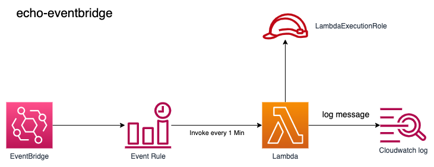

# echo-eventbridge

[Amazon EventBridge 에 AWS Lambda 사용](https://docs.aws.amazon.com/ko_kr/lambda/latest/dg/services-cloudwatchevents.html) 시나리오 Practice 입니다.  

1 분 간격으로 eventbridge 를 통해 lambda 가 호출 되며 lambda 실행 로그를 cloudwatch log 그룹에 적재 됩니다. 

## Architecture




## Git
```
git clone https://github.com/chiwoo-cloud-native/aws-lambda-samples.gi
```


## Build
`echo-eventbridge` 경로로 이동하여 npm install 명령을 통해 프로젝트를 빌드 합니다.

```
cd echo-eventbridge

npm install
```

## Test

[package.json](./package.json) 파일의 scripts.test 커멘드는 mocha 를 통해 테스트 하도록 정의 하고 있습니다.

```
npm test
```


## Build Image
`aws-lambda-samples` 프로젝트 기준 경로에서 docker build 명령을 실행 합니다.

```
docker build -t echo-eventbridge:latest -f ./echo-eventbridge/Dockerfile .
```

