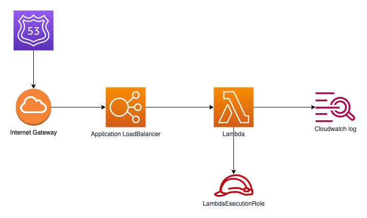

# helloworld

Application LoadBalancer 와 Lambda 를 통합한 helloworld Lambda 애플리케이션을 구현 하고 배포 합니다.  

## Architecture



## Git
```
git clone https://github.com/chiwoo-cloud-native/aws-lambda-samples.gi
```


## Build
`helloworld` 경로로 이동하여 npm install 명령을 통해 프로젝트를 빌드 합니다.

```
cd helloworld

npm install
```

## Test

[package.json](./package.json) 파일의 scripts.test 커멘드는 mocha 를 통해 테스트 하도록 정의 하고 있습니다.

```
npm test
```


## Build Image
`aws-lambda-samples` 프로젝트 기준 경로에서 docker build 명령을 실행 합니다.

```
docker build -t helloworld:latest -f ./helloworld/Dockerfile .
```

